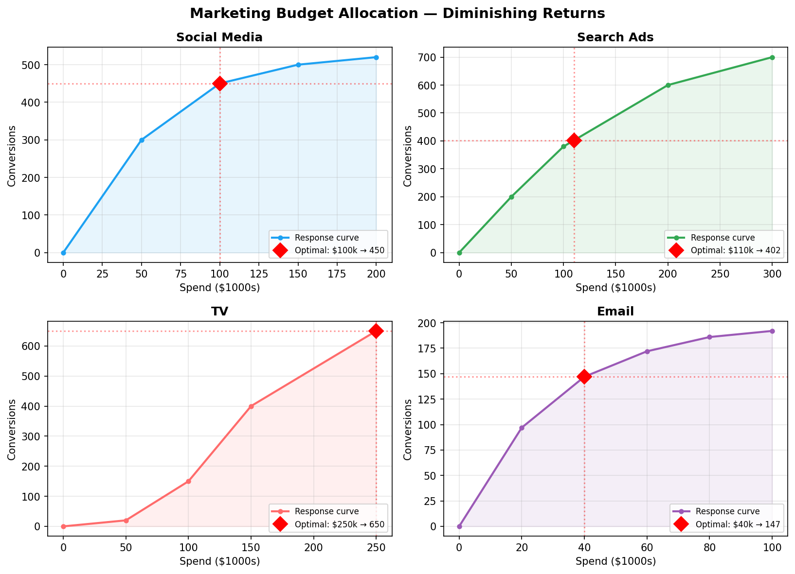
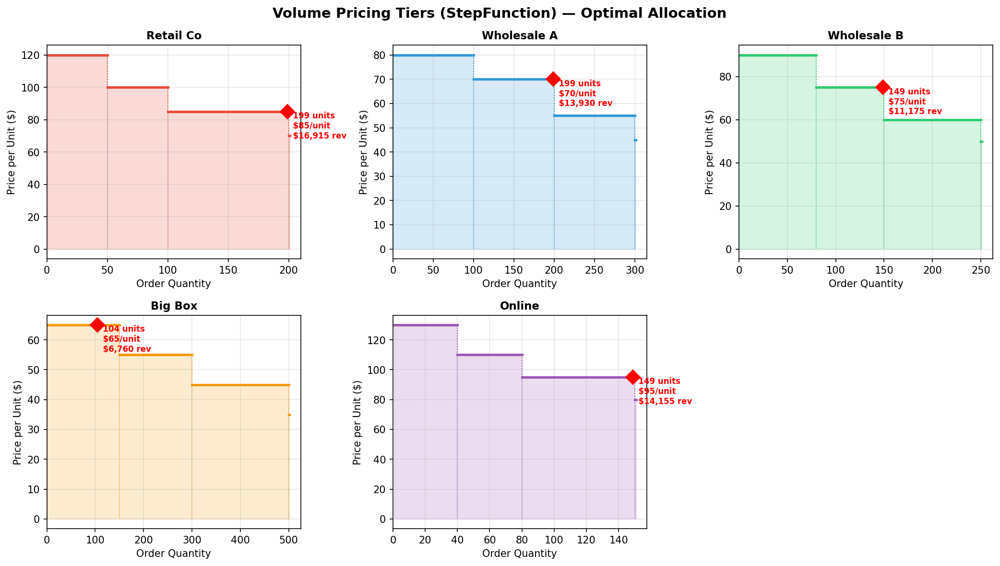
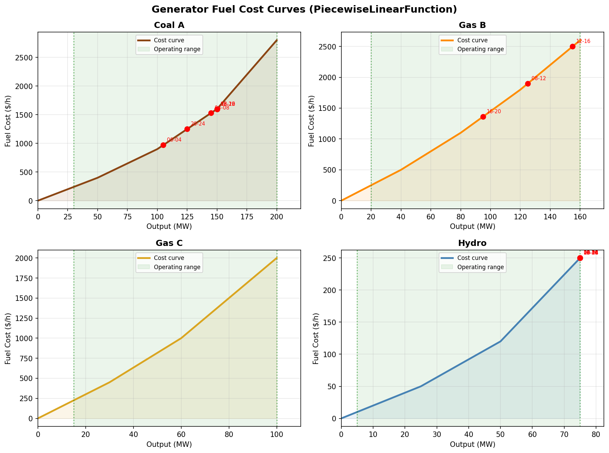
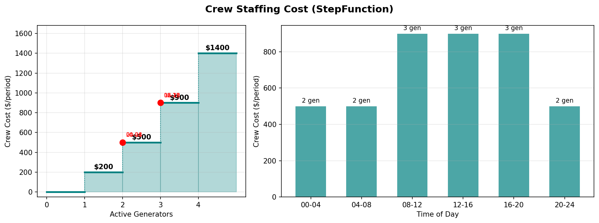
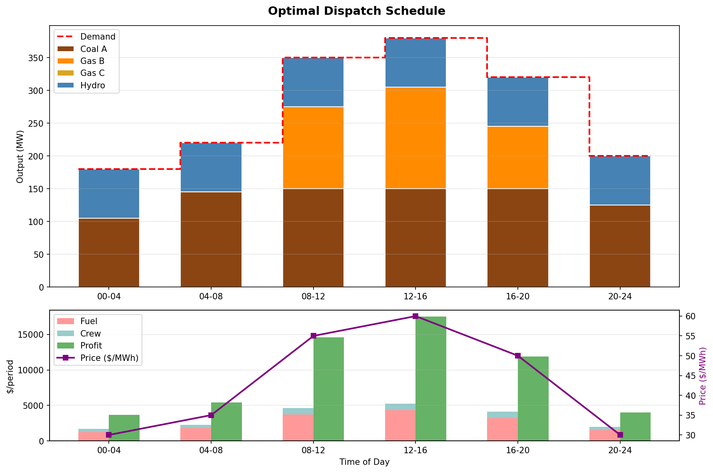

# Examples

These examples demonstrate how to use `cpsat_utils` piecewise functions in
realistic optimization models. They are ordered by complexity — start at the
top and work down.

> **Note:** CP-SAT is a constraint programming solver optimized for problems
> with logical structure (discrete choices, scheduling, routing, etc.). For
> pure non-linear optimization — like these standalone examples — dedicated
> solvers (SCIP, Gurobi, or nonlinear solvers) are typically a better fit and
> don't require integer approximations. However, piecewise functions become
> valuable when they appear as *part of a larger model* that genuinely needs
> CP-SAT's strengths — e.g., a scheduling problem where cost curves are
> non-linear, or a configuration problem with tiered pricing. These examples
> are kept simple to focus on the API; real use cases usually involve
> additional combinatorial constraints.

## 1. Budget Allocation — PiecewiseLinearFunction basics

**[`budget_allocation.py`](budget_allocation.py)**

A company allocates a shared marketing budget across 4 channels, each with a
diminishing-returns response curve. The optimizer finds the split that
maximizes total conversions.

**Key concepts:** `PiecewiseLinearFunction` construction (from breakpoints and
`from_function`), `add_upper_bound` for maximization, shared resource
constraint.

```
Total budget: $500k
Total conversions: 1649

Channel            Spend   Conversions
--------------------------------------------------
Social Media    $   100k        450
Search Ads      $   110k        402
TV              $   250k        650
Email           $    40k        147
```



---

## 2. Pricing Tiers — StepFunction basics

**[`pricing_tiers.py`](pricing_tiers.py)**

A distributor allocates limited warehouse stock across 5 customers. Each
customer's unit price depends on order size (bulk discounts), modeled as a
`StepFunction`. The optimizer navigates discrete pricing tiers to maximize
total revenue.

**Key concepts:** `StepFunction` construction, `add_constraint` where the
input is a decision variable, `add_multiplication_equality` for
revenue = quantity x price.

```
Warehouse stock: 800 units
Total revenue: $62,935

Customer         Qty    Price    Revenue Tier
------------------------------------------------------------
Retail Co        199 $85/unit $  16,915   (100-199 units)
Wholesale A      199 $70/unit $  13,930   (100-199 units)
Wholesale B      149 $75/unit $  11,175   (80-149 units)
Big Box          104 $65/unit $   6,760   (1-149 units)
Online           149 $95/unit $  14,155   (80-149 units)
```



---

## 3. Energy Dispatch — combining both function types

**[`energy_dispatch.py`](energy_dispatch.py)**

A utility company dispatches 4 generators across 6 time periods to meet
electricity demand at minimum cost. Fuel costs follow piecewise linear curves
(efficiency drops at high output). Crew staffing costs follow a step function
(more active generators require more crews with discrete cost jumps).

**Key concepts:** `PiecewiseLinearFunction.add_lower_bound` for convex cost
minimization, `StepFunction.add_constraint`, indicator constraints (on/off
decisions), multi-period scheduling.

```
Total fuel cost:  $  15,813
Total crew cost:  $   4,200
Total cost:       $  20,013
Total revenue:    $  77,150
Profit:           $  57,137
```

### Generator cost curves with operating points per period



### Crew staffing step function



### Optimal dispatch schedule



---

## Running

Each example is self-contained. Run with:

```bash
python examples/budget_allocation.py
python examples/pricing_tiers.py
python examples/energy_dispatch.py
```

Requires `matplotlib` and `numpy` for plots (in addition to `cpsat-utils` and
`ortools`).
